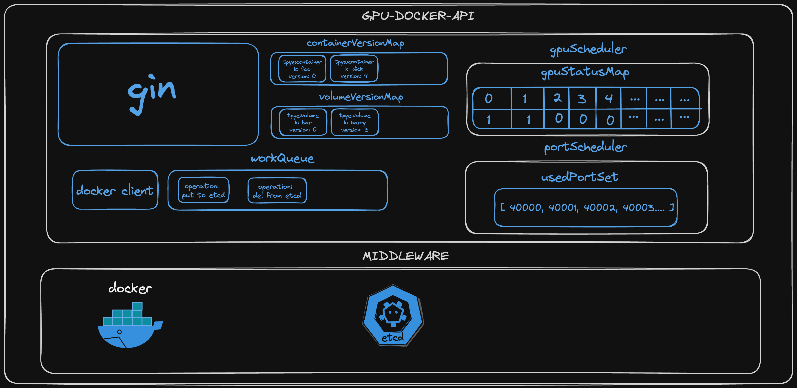

# GPU-Docker-API

[zh-cn](..%2FREADME.md)

# Overview

Use the Docker Client to invoke NVIDIA Docker to realize the business functions of GPU containers.

For example, lifting and lowering GPU container configurations, starting containers without cards, and scaling up and
down volume size.

Similar to the operation on container instances in [AutoDL](https://www.autodl.com/docs/env/).

- [GPU-Docker-API](#gpu-docker-api)
- [Overview](#overview)
- [Feature](#feature)
    - [Container](#container)
    - [Volume](#volume)
    - [GPU](#gpu)
    - [Port](#port)
- [Quick Start](#quick-start)
    - [API](#api)
    - [Environmental Preparation](#environmental-preparation)
    - [Build from Source](#build-from-source)
- [Architecture](#architecture)
    - [Component Introduction](#component-introduction)
    - [Architecture Diagram](#architecture-diagram)
    - [Documents](#documents)
- [Contribute](#contribute)
- [Environment](#environment)

First I have to describe to you what a GPU container's directory should look like when it starts. It is as follows:

| name         | path          | performance           | description                                                                                                                                                                                                                                                                                                                        |
|--------------|---------------|-----------------------|------------------------------------------------------------------------------------------------------------------------------------------------------------------------------------------------------------------------------------------------------------------------------------------------------------------------------------|
| system disk  | /             | local disk, fast      | Data will not be lost when the container is stopped. Generally system dependencies and Python installers will be under the system disk, which will be preserved when saving the image. The data will be copied to the new container after the container lifts and drops the GPU and Volume configurations.                         | Data Disk | /root
| Data Disk    | /root/foo-tmp | Local, Fast           | Use Docker Volume to mount, the data will not be lost when the container is stopped, and will not be retained when the image is saved. It is suitable for storing data with high IO requirements for reading and writing. The data will be copied to the new container after the container lifts the GPU and Volume configuration. | File Storage | /root
| File Storage | /root/foo-fs  | Network Disk, General | Enables synchronized file sharing across multiple containers, such as NFS.                                                                                                                                                                                                                                                         |

We then discuss update operations (lifting and lowering GPU container configurations, expanding and shrinking Volume
data volumes, all of these are update operations, and for ease of understanding, we will use the term "update" below
instead of these specific operations).

When we update a container, a new container is created. For example, if the old container foo-0 was using 3 graphics
cards, and we want it to use 5, calling the interface creates the new container
foo-1 will be created to replace foo-0 (foo-0 will not be deleted), similar to how updating a Pod in K8s will be a
rolling replacement.

It's worth noting that the new container doesn't look much different from the old one, except for the parts we specified
to be updated, and even the software you installed, which will appear in the new container as is. Not to mention, the
data disk, file storage, environment variables, and port mapping, which looks pretty cool
😎.

The same is true when updating Volume.

# Feature

## Container

- [x] Create GPU Container
- [x] Create Cardless Container
- [x] Patch Container GPU Configuration
- [x] Patch Container Volume Configuration
- [x] Stop Container
- [x] Restart Container
- [x] Execute commands inside the container
- [x] Delete Container
- [x] Save container as image

## Volume

- [x] Create a Volume of the specified capacity size
- [x] Delete Volume
- [x] Expand or reduce Volume

## GPU

- [x] View GPU Usage

## Port

- [x] View Used Ports

# Quick Start

[👉 Click here to see, my environment](#Environment)

## API

You can do this by importing the  [gpu-docker-api.openapi.json](..%2Fapi%2Fgpu-docker-api.openapi.json)
or check [gpu-docker-api-sample-interface.md](..%2Fapi%2Fgpu-docker-api-sample-interface.md)  to understand and call the
interface.

## Environmental Preparation

1. The test environment has already installed the corresponding drivers for the NVIDIA graphics card.
2. Make sure you have NVIDIA Docker installed on your test environment, installation
   tutorial: [NVIDIA Docker Installation](https://zhuanlan.zhihu.com/p/361934132).
3. To support the creation of a Volume of the specified size, ensure that Docker's Storage Driver is Overlay2. Create
   and format a partition as an XFS file system, and use the mounted directory as the
   Docker Root Dir. 
   tutorial: [volume-size-scale.md](volume%2Fvolume-size-scale.md)
4. Make sure your test environment has ETCD V3 installed, installation
   tutorial: [ETCD](https://github.com/etcd-io/etcd).
5. Clone and run [detect-gpu](https://github.com/mayooot/detect-gpu).

## Build from source

### Build

~~~
git clone https://github.com/mayooot/gpu-docker-api.git
cd gpu-docker-api
make build
~~~

### Modify configuration file (optional)

~~~
vim etc/config.yaml
~~~

### Run

~~~
./gpu-docker-api-${your_os}-amd64
~~~

# Architecture

The design is inspired by and borrows a lot from Kubernetes.

For example, K8s adds full information about resources (Pods, Deployment, etc.) to the ETCD and then uses the ETCD
version number for rollback.

And workQueue asynchronous processing in Client-go.

## Component Introduction

* gin：Handles HTTP requests and interface routing.

* docker-client：Docker interaction with the server.

* workQueue：Asynchronous processing tasks, for example:

    * When a Container/Volume is created, add the created information to the ETCD.
    * After deleting a Container/Volume, delete the full information about the resource from the ETCD.
    * After upgrading the GPU/Volume configuration of a Container, copy the data of the old Container to the new
      Container.
    * After upgrading the capacity size of a Volume resource, copy the data of the old Volume to the new Volume.

* container/volume VersionMap：

    * Generate version number when creating Container, default is 0, when Container is updated, the version number will
      be +1.
    * Generate the version number when creating a Volume, default is 0, when the Volume is updated, the version number
      is +1.

      When the program is closed, the VersionMap is written to the ETCD, and when the program is started again, the data
      is pulled from the ETCD and initialized.
* gpuScheduler：A scheduler that allocates GPU resources and saves the container's occupancy using GPUs to gpuStatusMap.
    * gpuStatusMap：
      Maintain the GPU resources of the server, when the program starts for the first time, call detect-gpu to get all
      the GPU resources, and initialize gpuStatusMap, Key is the GPU's
      Key is the UUID of the GPU, Value is the usage, 0 means unoccupied, 1 means occupied.

      When the program is closed, the gpuStatusMap is written to the ETCD, and when the program is started again, the
      data is pulled from the ETCD and initialized.

* portScheduler：The scheduler that allocates Port resources and saves the Port resources used by the container to
  usedPortSet.
    * usedPortSet:
      Maintains the server's port resources. Ports that are already occupied are added to this Set.

      When the program is closed, the usedPortSet is written to the ETCD, and when the program is started again, the
      data is pulled from the ETCD and initialized.

* docker：The component that actually creates the resources such as Container, Volume, etc. and installs the NVIDIA
  Container Toolkit with the ability to schedule GPUs.

* etcd：Holds the full amount of creation information for the Container/Volume, as well as generating Version fields such
  as mod_revision for rolling back the historical version of the resource. The resources stored in the ETCD
  The resources stored in the ETCD are as follows:

    * /apis/v1/containers
    * /apis/v1/volumes
    * /apis/v1/gpus/gpuStatusMapKey
    * /apis/v1/ports/usedPortSetKey
    * /apis/v1/versions/containerVersionMapKey
    * /apis/v1/versions/volumeVersionMapKey

* dete-gpu：A small utility that calls go-nvml and provides an HTTP interface at startup to get GPU information.

## Architecture Diagram

## Documents

* Implementation of the container lifting GPU
  resources: [container-gpu-scale.md](container%2Fcontainer-gpu-scale.md)
* Volume expansion and contraction implementation: [volume-size-scale.md](volume%2Fvolume-size-scale.md)

# Contribute

Feel free to open issues and pull requests. Any feedback is highly appreciated!

# Environment

## Development Environment

~~~ 
$ sw_vers
ProductName:		macOS
ProductVersion:		14.0
BuildVersion:		23A344

$ sysctl -n machdep.cpu.brand_string
Apple M1

$ go version
go version go1.21.5 darwin/arm64
~~~

## Test Environment

~~~
$ cat /etc/issue
Ubuntu 20.04.4 LTS
~~~

~~~
$ docker info
Client: Docker Engine - Community
 Version:    24.0.5
 Context:    default
 Debug Mode: false
 Plugins:
  buildx: Docker Buildx (Docker Inc.)
    Version:  v0.11.2
    Path:     /usr/libexec/docker/cli-plugins/docker-buildx
  compose: Docker Compose (Docker Inc.)
    Version:  v2.20.2
    Path:     /usr/libexec/docker/cli-plugins/docker-compose

Server:
 Containers: 27
  Running: 20
  Paused: 0
  Stopped: 7
 Images: 38
 Server Version: 24.0.5
 Storage Driver: overlay2
  Backing Filesystem: xfs
  Supports d_type: true
  Using metacopy: false
  Native Overlay Diff: true
  userxattr: false
 Logging Driver: json-file
 Cgroup Driver: cgroupfs
 Cgroup Version: 1
 Plugins:
  Volume: local
  Network: bridge host ipvlan macvlan null overlay
  Log: awslogs fluentd gcplogs gelf journald json-file local logentries splunk syslog
 Swarm: inactive
 Runtimes: io.containerd.runc.v2 runc
 Default Runtime: runc
 Init Binary: docker-init
 containerd version: 8165feabfdfe38c65b599c4993d227328c231fca
 runc version: v1.1.8-0-g82f18fe
 init version: de40ad0
 Security Options:
  apparmor
  seccomp
   Profile: builtin
 Kernel Version: 5.4.0-100-generic
 Operating System: Ubuntu 20.04.4 LTS
 OSType: linux
 Architecture: x86_64
 CPUs: 112
 Total Memory: 1.968TiB
 Name: langfang21
 ID: 58c56043-2c92-4d9f-8cb7-14ffa0541531
 Docker Root Dir: /localData/docker
 Debug Mode: false
 Username: *****
 Experimental: false
 Insecure Registries:
  *****
  127.0.0.0/8
 Registry Mirrors:
  *****
  *****
 Live Restore Enabled: false

WARNING: No swap limit support

~~~

~~~
$ nvidia-smi 
Sat Dec  9 09:04:06 2023       
+-----------------------------------------------------------------------------+
| NVIDIA-SMI 525.85.12    Driver Version: 525.85.12    CUDA Version: 12.0     |
|-------------------------------+----------------------+----------------------+
| GPU  Name        Persistence-M| Bus-Id        Disp.A | Volatile Uncorr. ECC |
| Fan  Temp  Perf  Pwr:Usage/Cap|         Memory-Usage | GPU-Util  Compute M. |
|                               |                      |               MIG M. |
|===============================+======================+======================|
|   0  NVIDIA A100 80G...  On   | 00000000:35:00.0 Off |                    0 |
| N/A   46C    P0    73W / 300W |  57828MiB / 81920MiB |      0%      Default |
|                               |                      |             Disabled |
+-------------------------------+----------------------+----------------------+
|   1  NVIDIA A100 80G...  On   | 00000000:36:00.0 Off |                    0 |
| N/A   44C    P0    66W / 300W |  51826MiB / 81920MiB |      0%      Default |
|                               |                      |             Disabled |
+-------------------------------+----------------------+----------------------+
|   2  NVIDIA A100 80G...  On   | 00000000:39:00.0 Off |                    0 |
| N/A   45C    P0    72W / 300W |  12916MiB / 81920MiB |      0%      Default |
|                               |                      |             Disabled |
+-------------------------------+----------------------+----------------------+
|   3  NVIDIA A100 80G...  On   | 00000000:3D:00.0 Off |                    0 |
| N/A   42C    P0    62W / 300W |  12472MiB / 81920MiB |      0%      Default |
|                               |                      |             Disabled |
+-------------------------------+----------------------+----------------------+
|   4  NVIDIA A100 80G...  On   | 00000000:89:00.0 Off |                    0 |
| N/A   48C    P0    72W / 300W |  26140MiB / 81920MiB |      0%      Default |
|                               |                      |             Disabled |
+-------------------------------+----------------------+----------------------+
|   5  NVIDIA A100 80G...  On   | 00000000:8A:00.0 Off |                    0 |
| N/A   40C    P0    45W / 300W |      2MiB / 81920MiB |      0%      Default |
|                               |                      |             Disabled |
+-------------------------------+----------------------+----------------------+
|   6  NVIDIA A100 80G...  On   | 00000000:8D:00.0 Off |                    0 |
| N/A   39C    P0    46W / 300W |      2MiB / 81920MiB |      0%      Default |
|                               |                      |             Disabled |
+-------------------------------+----------------------+----------------------+
|   7  NVIDIA A100 80G...  On   | 00000000:91:00.0 Off |                    0 |
| N/A   39C    P0    46W / 300W |      2MiB / 81920MiB |      0%      Default |
|                               |                      |             Disabled |
+-----------------------------------------------------------------------------+
                                                                               
+-----------------------------------------------------------------------------+
| Processes:                                                                  |
|  GPU   GI   CI        PID   Type   Process name                  GPU Memory |
|        ID   ID                                                   Usage      |
|=============================================================================|
|    0   N/A  N/A    ******      C   ******                            *****MiB |
|    0   N/A  N/A    ******      C   ******                            *****MiB |
|    0   N/A  N/A    ******      C   ******                            *****MiB |
|    0   N/A  N/A    ******      C   ******                            *****MiB |
|    0   N/A  N/A    ******      C   ******                            *****MiB |
|    0   N/A  N/A    ******      C   ******                            *****MiB |
|    0   N/A  N/A    ******      C   ******                            *****MiB |
|    1   N/A  N/A    ******      C   ******                            *****MiB |
|    2   N/A  N/A    ******      C   ******                            *****MiB |
|    3   N/A  N/A    ******      C   ******                            *****MiB |
|    4   N/A  N/A    ******      C   ******                            *****MiB |
|    4   N/A  N/A    ******      C   ******                            *****MiB |
+-----------------------------------------------------------------------------+
~~~

